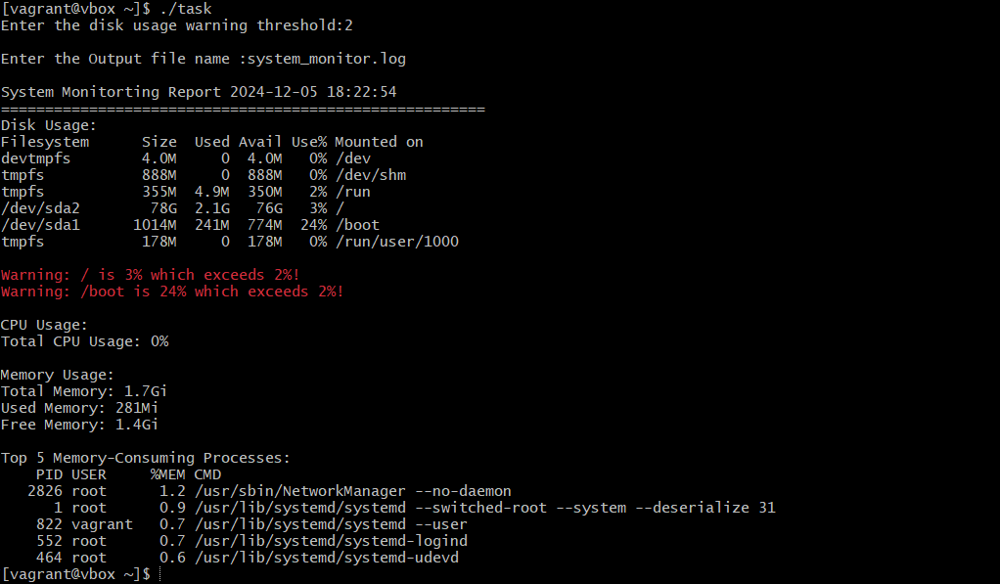

# Syste-Monitoring-Script
Absolutely! Here's a professional README file for your system monitoring script:

---

# System Monitoring Script

## Overview

This repository contains a Bash script designed to monitor system resources, including disk usage, CPU usage, memory usage, and the top memory-consuming processes. The script generates a detailed report that highlights any potential issues, such as disk usage exceeding a specified threshold.

## Repository Structure

- **monitor.sh**: The main Bash script for system monitoring.

## Prerequisites

Ensure you have the following installed on your system:
- Bash (available by default on most Unix-based systems)

## Usage

### Running the Script

1. **Clone the Repository**
   ```bash
   git clone https://github.com/ShahdMenaisy/system-monitoring-script.git
   cd system-monitoring-script
   ```

2. **Make the Script Executable**
   ```bash
   chmod +x monitor.sh
   ```

3. **Run the Script**
   ```bash
   ./monitor.sh
   ```

### Script Input
- The script prompts the user to enter a disk usage warning threshold and an output file name for the log.

### Example Execution
```bash
./monitor.sh
Enter the disk usage warning threshold: 80
Enter the Output file name: system_monitor.log
```

## Script Output

The script generates a comprehensive system monitoring report including:
1. **Disk Usage**: Reports the percentage of disk space used for each mounted partition and warns if usage exceeds the specified threshold.
2. **CPU Usage**: Displays the current CPU usage as a percentage.
3. **Memory Usage**: Shows total, used, and free memory.
4. **Top Memory-Consuming Processes**: Lists the top 5 processes consuming the most memory.

### Sample Report
Here is an example of the script's output:



## Enhancements

The script can be extended to include additional system monitoring metrics or integrated into a larger monitoring framework. Here are a few enhancement ideas:
- **Service Health**: Check and report the health of critical system services.
- **Automated Alerts**: Send automated alerts via email or messaging services if thresholds are exceeded.

## Conclusion

This Bash script provides a quick and effective way to monitor essential system resources and generate detailed reports, helping system administrators ensure the health and performance of their systems.

---
